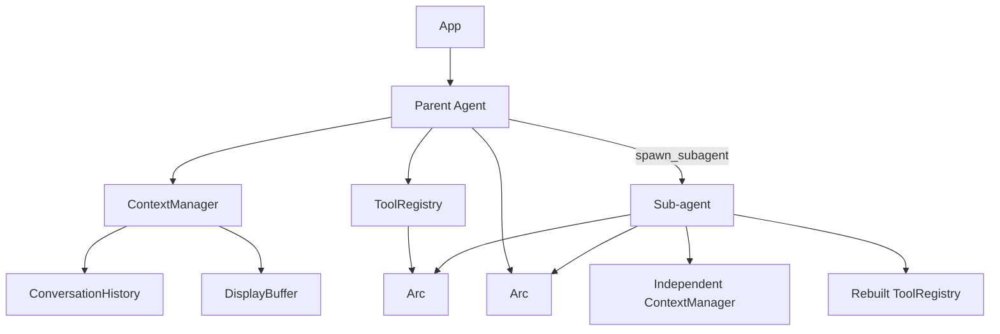
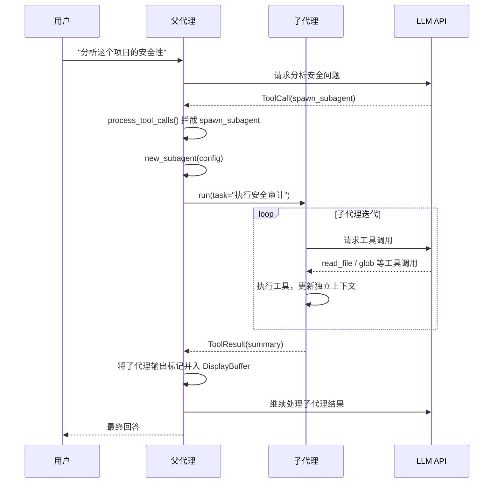

# Dev-Assistant-RS 子代理功能设计方案

## 1. 设计背景

当前 dev-assistant-rs 是单代理架构，所有任务由一个 Agent 串行执行。对于复杂任务（如代码审查、安全审计、多文件分析），需要引入子代理机制，将大任务拆分为多个独立子任务并行/串行执行，提升效率和质量。

## 2. 设计目标

| 目标 | 描述 |
|------|------|
| **任务分解** | 支持将复杂任务拆分为独立子任务，由子代理并行/串行执行 |
| **资源隔离** | 子代理拥有独立的对话上下文，不污染父代理的 LLM 上下文 |
| **安全控制** | 子代理继承父代理的安全策略，防止权限提升和资源滥用 |
| **深度限制** | 防止无限递归调用，设置最大代理深度 |
| **透明集成** | 子代理输出融入现有 UI，无需新增面板 |
| **最小侵入** | 避免循环所有权问题，不修改 ToolContext 和 ToolHandler 签名 |

## 3. 架构设计

### 3.1 核心组件关系



### 3.2 执行流程



### 3.3 架构决策说明

| 问题 | 原方案 | 问题描述 | 修正方案 |
|------|--------|---------|---------|
| 循环所有权 | `ToolContext` 持有 `Arc<Mutex<Agent>>` | Agent → ToolRegistry → ToolContext → Agent 形成循环 | 在 `process_tool_calls` 中特殊处理 `spawn_subagent` |
| 同步/异步 | `ToolHandler` 是同步的 | 子代理需要异步执行 `Agent::run()` | 在 `process_tool_calls` 中直接调用异步方法 |
| ToolRegistry 克隆 | `ToolRegistry::clone()` | `Box<ToolHandler>` 不实现 `Clone` | 子代理重新构建 ToolRegistry（调用工具构造函数） |

## 4. 详细设计

### 4.1 LlmClient 改为 Arc 封装

**修改文件:** [src/agent/mod.rs](file:///Users/macmima1234/code/dev-assistant-rs/src/agent/mod.rs)

```rust
pub struct Agent {
    context: ContextManager,
    tools: ToolRegistry,
    llm: Arc<LlmClient>,      // 修改：从 LlmClient 改为 Arc<LlmClient>
    max_iterations: usize,
    skills: Vec<Skill>,
    depth: usize,             // 新增：当前代理深度，根代理为 0
}

const MAX_SUBAGENT_DEPTH: usize = 3;
```

### 4.2 新增子代理构造函数

**修改文件:** [src/agent/mod.rs](file:///Users/macmima1234/code/dev-assistant-rs/src/agent/mod.rs)

```rust
impl Agent {
    /// 创建子代理。
    /// 
    /// - `task_prompt`: 子代理的任务描述，将作为系统提示词的一部分
    /// - `allowed_tools`: 允许使用的工具列表（None = 继承父代理工具但移除 spawn_subagent）
    /// - `max_iterations`: 子代理最大迭代次数
    /// - `max_tokens`: 子代理的 Token 预算
    /// 
    /// 返回 `Err(AppError::SubagentDepthLimit)` 当超过最大深度限制时。
    pub fn new_subagent(
        &self,
        task_prompt: String,
        allowed_tools: Option<Vec<String>>,
        max_iterations: usize,
        max_tokens: usize,
    ) -> Result<Self, AppError> {
        if self.depth >= MAX_SUBAGENT_DEPTH {
            return Err(AppError::SubagentDepthLimit);
        }

        // 构建子代理的系统提示词（基于父代理的工具列表过滤）
        let tool_schemas = self.tools.get_tool_schemas();
        let filtered_schemas: Vec<ToolSchema> = match &allowed_tools {
            Some(tools) => tool_schemas
                .into_iter()
                .filter(|s| tools.contains(&s.function.name))
                .collect(),
            None => tool_schemas,
        };

        // 子代理专用系统提示词：强调任务目标和限制
        let system_prompt = format!(
            r#"你是一个子代理，正在执行父代理分配的任务。

任务目标：{}

规则：
1. 专注完成分配的任务，不要做无关操作
2. 完成任务后必须使用 finish 工具结束
3. 不要调用 spawn_subagent 工具
4. 遵守与父代理相同的安全策略

可用工具：
{}"#,
            task_prompt,
            format_tool_descriptions(&filtered_schemas)
        );

        let context = ContextManager::new(system_prompt, max_tokens);

        // 重新构建工具注册表（不包含 spawn_subagent）
        let sub_tools = ToolRegistry::new_subagent_registry(
            self.tools.working_dir.clone(),
            self.tools.security.clone(),
            allowed_tools,
        );

        Ok(Self {
            context,
            tools: sub_tools,
            llm: self.llm.clone(),
            max_iterations,
            skills: Vec::new(),
            depth: self.depth + 1,
        })
    }
}
```

### 4.3 ToolRegistry 新增子代理注册表方法

**修改文件:** [src/tools/mod.rs](file:///Users/macmima1234/code/dev-assistant-rs/src/tools/mod.rs)

```rust
impl ToolRegistry {
    /// 创建子代理专用的工具注册表。
    /// 
    /// - `working_dir`: 工作目录
    /// - `security`: 安全策略（继承父代理）
    /// - `allowed_tools`: 允许使用的工具列表（None = 全部工具但移除 spawn_subagent）
    pub fn new_subagent_registry(
        working_dir: PathBuf,
        security: Arc<SecurityPolicy>,
        allowed_tools: Option<Vec<String>>,
    ) -> Self {
        let mut registry = Self {
            tools: HashMap::new(),
            working_dir,
            security,
        };

        // 注册所有工具（除了 spawn_subagent）
        let all_tools = vec![
            file::read_file_tool(),
            file::batch_read_files_tool(),
            file::write_file_tool(),
            file::edit_file_tool(),
            file::glob_tool(),
            file::list_directory_tool(),
            file::file_exists_tool(),
            system_tools::exec_command_tool(),
            meta_tools::finish_tool(),
            meta_tools::restart_tool(),
        ];

        for tool in all_tools {
            if let Some(ref allowed) = allowed_tools {
                if allowed.contains(&tool.name) {
                    registry.register(tool);
                }
            } else {
                registry.register(tool);
            }
        }

        registry
    }
}
```

### 4.4 process_tool_calls 拦截 spawn_subagent

**修改文件:** [src/agent/mod.rs](file:///Users/macmima1234/code/dev-assistant-rs/src/agent/mod.rs)

```rust
impl Agent {
    async fn process_tool_calls(
        &mut self,
        tool_calls: &[ToolCall],
        output: &mut dyn MessageOutput,
    ) -> Result<Vec<ToolResult>, AppError> {
        let mut results = Vec::new();

        for tool_call in tool_calls {
            output.info(&format!("执行工具: {} (id: {})", tool_call.function.name, tool_call.id));
            debug!(tool = %tool_call.function.name, args = %tool_call.function.arguments, "Tool arguments");

            // 特殊处理 spawn_subagent（子代理创建）
            if tool_call.function.name == "spawn_subagent" {
                let result = self.spawn_subagent(&tool_call.function.arguments, output).await?;
                results.push(result);
                continue;
            }

            // 根据工具的 skip_security 标记决定走 execute_approved 还是 execute
            let result = match self.tools.execute_with_policy(
                &tool_call.function.name,
                tool_call.function.arguments.clone(),
            ) {
                Ok(r) => r,
                Err(e) => ToolResult {
                    success: false,
                    content: format!("[error] Tool '{}' execution failed: {}", tool_call.function.name, e),
                    security_evaluation: None,
                    restart_requested: false,
                },
            };

            if let Some(ref eval) = result.security_evaluation {
                output.warning(&format!(
                    "{} 安全评估 ({}): {}",
                    tool_call.function.name,
                    eval.danger_level.as_str(),
                    eval.reason
                ));
            }

            if result.success {
                output.success(&format!("工具 {} 执行成功", tool_call.function.name));
            } else {
                output.error(&format!("工具 {} 执行失败", tool_call.function.name));
            }
            results.push(result);
        }

        Ok(results)
    }

    /// 创建并执行子代理。
    async fn spawn_subagent(
        &self,
        arguments: &Value,
        output: &mut dyn MessageOutput,
    ) -> Result<ToolResult, AppError> {
        let task = arguments["task"].as_str()
            .ok_or_else(|| AppError::ToolArgument("task is required".to_string()))?;
        
        let tools: Option<Vec<String>> = arguments["tools"]
            .as_array()
            .map(|a| a.iter().filter_map(|v| v.as_str().map(String::from)).collect());
        
        let max_iterations = arguments["max_iterations"].as_u64()
            .map(|n| n as usize)
            .unwrap_or(10);
        
        let max_tokens = arguments["max_tokens"].as_u64()
            .map(|n| n as usize)
            .unwrap_or(8192);

        output.info(&format!("[子代理] 正在创建子代理执行任务: {}", task));

        // 创建子代理
        let mut subagent = self.new_subagent(
            task.to_string(),
            tools,
            max_iterations,
            max_tokens,
        )?;

        // 运行子代理
        let mut sub_output = crate::ui::CliMessageOutput::new(false);
        let result = subagent.run(task.to_string(), &mut sub_output).await?;

        // 将子代理输出标记并入父代理的展示缓冲区
        for (level, msg) in sub_output.drain() {
            output.info(&format!("[子代理] {}: {}", level.label(), msg));
        }

        // 构建子代理输出摘要
        let summary = format!("[子代理结果] {}", result.message);

        output.success(&format!("[子代理] 任务完成"));

        Ok(ToolResult {
            success: result.success,
            content: summary,
            security_evaluation: None,
            restart_requested: false,
        })
    }
}
```

### 4.5 新增 spawn_subagent 工具定义

**修改文件:** [src/tools/subagent.rs](file:///Users/macmima1234/code/dev-assistant-rs/src/tools/subagent.rs)

```rust
use serde_json::Value;

use crate::tools::{ToolArgs, ToolContext, ToolDefinition, ToolResult};
use crate::utils::error::AppError;

pub fn spawn_subagent_tool() -> ToolDefinition {
    ToolDefinition {
        name: "spawn_subagent".to_string(),
        description: "创建子代理执行独立子任务。适用于文件搜索、代码分析、并行研究等独立工作。返回子代理的执行结果摘要。".to_string(),
        parameters: serde_json::json!({
            "type": "object",
            "properties": {
                "task": { "type": "string", "description": "子代理需要完成的任务描述" },
                "tools": {
                    "type": "array",
                    "items": { "type": "string" },
                    "description": "允许子代理使用的工具列表（可选，不指定则继承父代理工具）"
                },
                "max_iterations": { "type": "integer", "default": 10, "description": "子代理最大迭代次数" },
                "max_tokens": { "type": "integer", "default": 8192, "description": "子代理的 Token 预算" }
            },
            "required": ["task"]
        }),
        skip_security: false,
        handler: Box::new(|_args: &ToolArgs, _context: &ToolContext| {
            // 此 handler 永远不会被调用，因为 spawn_subagent 在 process_tool_calls 中被特殊处理
            Err(AppError::ToolNotFound("spawn_subagent".to_string()))
        }),
    }
}
```

### 4.6 在 ToolRegistry 中注册 spawn_subagent 工具

**修改文件:** [src/tools/mod.rs](file:///Users/macmima1234/code/dev-assistant-rs/src/tools/mod.rs)

```rust
mod subagent;

impl ToolRegistry {
    fn register_builtin_tools(&mut self) {
        self.register(file::read_file_tool());
        self.register(file::batch_read_files_tool());
        self.register(file::write_file_tool());
        self.register(file::edit_file_tool());
        self.register(file::glob_tool());
        self.register(file::list_directory_tool());
        self.register(file::file_exists_tool());
        self.register(system_tools::exec_command_tool());
        self.register(meta_tools::finish_tool());
        self.register(meta_tools::restart_tool());
        self.register(subagent::spawn_subagent_tool());  // 新增
    }
}
```

### 4.7 AppError 新增错误类型

**修改文件:** [src/utils/error.rs](file:///Users/macmima1234/code/dev-assistant-rs/src/utils/error.rs)

```rust
#[derive(Debug)]
pub enum AppError {
    // ... 现有错误类型 ...
    SubagentDepthLimit,
}

impl fmt::Display for AppError {
    fn fmt(&self, f: &mut fmt::Formatter) -> fmt::Result {
        match self {
            // ... 现有实现 ...
            AppError::SubagentDepthLimit => write!(f, "Sub-agent depth limit exceeded"),
        }
    }
}
```

### 4.8 系统提示词更新

**修改文件:** [src/prompt.rs](file:///Users/macmima1234/code/dev-assistant-rs/src/prompt.rs)

在工具使用建议部分添加：

```rust
r#"工具使用建议（以下全是工具名称，可以调用）：
- spawn_subagent: 创建子代理执行独立子任务。适用于：
  * 文件搜索和分析（如代码审查、文档理解）
  * 并行研究（同时搜索多个主题）
  * 复杂任务分解（将大任务拆分为多个子任务）
  * 需要专注执行的独立工作流
  使用方式：指定 task 描述子任务，可选 tools 限制子代理可用工具
  注意：子代理有深度限制（最多 3 层），完成后自动返回结果摘要
- exec_command: ...
"#
```

## 5. UI 展示策略

子代理的输出通过 `[subagent]` 前缀标记，直接融入现有的展示缓冲区：

```
◂ 助手: 正在创建子代理进行安全审计...
[子代理] 信息: 执行工具: glob (id: call_0)
[子代理] 成功: 工具 glob 执行成功
[子代理] 信息: 执行工具: read_file (id: call_1)
[子代理] 成功: 工具 read_file 执行成功
[子代理] 任务完成
◂ 助手: 安全审计完成，共发现 3 个问题：...
```

## 6. 安全性考虑

| 风险点 | 防护措施 | 实施位置 |
|--------|---------|---------|
| 无限递归 | `depth` 字段 + `MAX_SUBAGENT_DEPTH` 限制（3 层） | Agent::new_subagent |
| Token 耗尽 | 子代理独立的 `max_tokens` 预算，建议为父代理的 50%-70% | spawn_subagent |
| 权限提升 | 子代理继承父代理的 `Arc<SecurityPolicy>` | ToolRegistry 构造 |
| 上下文污染 | 子代理使用独立的 `ContextManager`，仅返回最终摘要 | Agent::new_subagent |
| 资源泄漏 | 子代理执行完毕后自动释放，不持有长期引用 | spawn_subagent |
| 工具滥用 | 子代理的 ToolRegistry 不包含 spawn_subagent | new_subagent_registry |

## 7. 实现步骤

| 阶段 | 任务 | 涉及文件 | 预期工作量 |
|------|------|---------|-----------|
| 1 | 修改 `Agent` 结构，`llm` 改为 `Arc<LlmClient>`，添加 `depth` 字段 | [src/agent/mod.rs](file:///Users/macmima1234/code/dev-assistant-rs/src/agent/mod.rs) | 30 分钟 |
| 2 | 添加 `new_subagent` 构造函数 | [src/agent/mod.rs](file:///Users/macmima1234/code/dev-assistant-rs/src/agent/mod.rs) | 1 小时 |
| 3 | 添加 `spawn_subagent` 异步方法到 `Agent` | [src/agent/mod.rs](file:///Users/macmima1234/code/dev-assistant-rs/src/agent/mod.rs) | 1 小时 |
| 4 | 在 `process_tool_calls` 中拦截 `spawn_subagent` | [src/agent/mod.rs](file:///Users/macmima1234/code/dev-assistant-rs/src/agent/mod.rs) | 30 分钟 |
| 5 | 添加 `new_subagent_registry` 方法到 `ToolRegistry` | [src/tools/mod.rs](file:///Users/macmima1234/code/dev-assistant-rs/src/tools/mod.rs) | 30 分钟 |
| 6 | 新增 `spawn_subagent` 工具定义 | [src/tools/subagent.rs](file:///Users/macmima1234/code/dev-assistant-rs/src/tools/subagent.rs) | 30 分钟 |
| 7 | 在 `ToolRegistry` 中注册新工具 | [src/tools/mod.rs](file:///Users/macmima1234/code/dev-assistant-rs/src/tools/mod.rs) | 15 分钟 |
| 8 | 添加 `SubagentDepthLimit` 错误类型 | [src/utils/error.rs](file:///Users/macmima1234/code/dev-assistant-rs/src/utils/error.rs) | 15 分钟 |
| 9 | 更新系统提示词 | [src/prompt.rs](file:///Users/macmima1234/code/dev-assistant-rs/src/prompt.rs) | 30 分钟 |
| 10 | 添加测试用例 | [src/tools/subagent.rs](file:///Users/macmima1234/code/dev-assistant-rs/src/tools/subagent.rs), [src/agent/mod.rs](file:///Users/macmima1234/code/dev-assistant-rs/src/agent/mod.rs) | 1-2 小时 |
| 11 | 端到端测试验证 | - | 1 小时 |

## 8. 测试计划

| 测试用例 | 描述 | 预期结果 |
|---------|------|---------|
| 子代理创建成功 | 父代理成功创建子代理并执行任务 | 返回 ToolResult 包含子代理输出 |
| 深度限制 | 超过 MAX_SUBAGENT_DEPTH 时拒绝创建 | 返回 SubagentDepthLimit 错误 |
| 工具过滤 | 子代理无法调用 spawn_subagent | 工具注册表中无 spawn_subagent |
| 安全策略继承 | 子代理遵守父代理的安全策略 | 危险命令仍被拦截 |
| 上下文隔离 | 子代理的对话历史不影响父代理 | 父代理 history 不包含子代理消息 |
| Token 预算 | 子代理受独立 max_tokens 限制 | 子代理上下文压缩按独立预算执行 |

## 9. 潜在问题与风险

| 问题 | 影响 | 缓解措施 |
|------|------|---------|
| LLM 开销增加 | 子代理调用增加 API 费用 | 限制子代理数量和 Token 预算 |
| 执行时间延长 | 子代理串行执行可能较慢 | 未来可支持并行子代理 |
| 工具参数传递 | 子代理无法访问父代理的工具调用结果 | 子代理结果作为 ToolResult 返回给父代理 |
| UI 输出混乱 | 子代理输出与父代理输出混合 | 使用 `[subagent]` 前缀区分 |

## 10. 未来扩展方向

| 扩展点 | 描述 |
|--------|------|
| 并行子代理 | 支持同时创建多个子代理并行执行不同任务 |
| 子代理通信 | 支持子代理之间共享信息（通过父代理中转） |
| 子代理优先级 | 支持为不同子代理分配不同优先级 |
| 子代理模板 | 预定义的子代理模板（如安全审计代理、代码审查代理） |
| 子代理监控 | 实时监控子代理执行状态，支持取消/暂停 |
